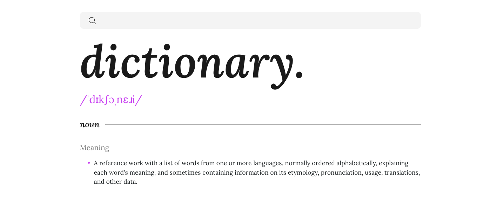
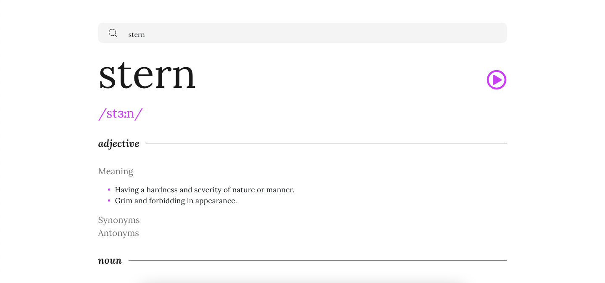

# Dictionarys_
# Frontend Mentor - Stats preview card component solution

This is a dictionary website. It was built with React, Sass, Css and Rest APi's. It enables users to search for the meaning of words and returns the appropraite response for the word searched.

## Table of contents

- [Overview](#overview)
  - [The challenge](#the-challenge)
  - [Screenshot](#screenshot)
  - [Links](#links)
- [My process](#my-process)
  - [Built with](#built-with)
- [Author](#author)

## Overview

### The challenge

Users should be able to:

- See the Free Dictionary API's response for the searched word
- Play the audio file for a word when it's available

### Screenshot

### Links

- Solution URL: (https://github.com/adebimpecole/Dictionarys_.git)
- Live Site URL: ()

## My process

### Built with

- Css
- Sass
- React
- Rest API's

## Author

- Website - [Mary Cole]()
- Twitter - [@adecole02](https://twitter.com/adecole02)

